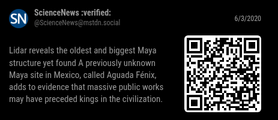

# MMM-Mastodon

**MMM-Mastodon** is a [MagicMirror²](https://magicmirror.builders) module that brings the decentralized world of [Mastodon](https://joinmastodon.org) to your smart mirror. Display your home timeline, follow hashtags, or track profiles with customizable options for media, rotation, and more – all while staying connected to the fediverse.

## Screenshot



## Features

- Fetch posts from Mastodon's home timeline, hashtag streams, or profile feeds.
- Configurable refresh interval, maximum items, media display, and more.
- Graceful handling of rate limits and API failures.

## Installation

```bash
cd ~/MagicMirror/modules
git clone https://github.com/KristjanESPERANTO/MMM-Mastodon
cd MMM-Mastodon
npm ci --omit=dev
```

## Update

Go to the module’s directory and pull the latest version from GitHub:

```bash
cd ~/MagicMirror/modules/MMM-Mastodon
git pull
npm ci --omit=dev
```

## Configuration

Add the module to the `modules` array in your `config/config.js`:

```js
    {
      module: "MMM-Mastodon",
      position: "top_left",
      config: {
        instanceUrl: "https://mastodon.social",
        accessToken: "YOUR_ACCESS_TOKEN",
        feedType: "profile", // home | hashtag | profile
        hashtag: "news", // required when feedType === "hashtag"
        profileAcct: "@ScienceNews@mstdn.social", // required when feedType === "profile"
        limit: 10,
        updateInterval: 300000,
        showMedia: true,
        dateFormat: "relative", // relative | absolute
        hideReplies: true,
        showQrCode: true,
        qrCodeSize: 128,
        maxLinkLength: 80,
        rotatePosts: true,
        rotationInterval: 15000
      }
    },
```

| Option             | Type              | Default    | Description                                                                                          |
| ------------------ | ----------------- | ---------- | ---------------------------------------------------------------------------------------------------- |
| `instanceUrl`      | `string`          | –          | Base URL of your Mastodon instance.                                                                  |
| `accessToken`      | `string`          | –          | Mastodon access token with `read` scope.                                                             |
| `feedType`         | `string`          | `home`     | Which timeline endpoint to read (`home`, `hashtag`, or `profile`).                                   |
| `hashtag`          | `string`          | –          | Required for hashtag feeds; do not include `#`.                                                      |
| `profileAcct`      | `string`          | –          | Mastodon handle such as `user@example.com`; required for profile feeds.                              |
| `limit`            | `number`          | `10`       | Maximum number of statuses to display.                                                               |
| `updateInterval`   | `number`          | `300000`   | Refresh rate in milliseconds.                                                                        |
| `showMedia`        | `boolean`         | `true`     | Whether to show attached images/videos as thumbnails.                                                |
| `dateFormat`       | `string`          | `relative` | Display timestamps relatively or as formatted dates.                                                 |
| `hideReplies`      | `boolean`         | `true`     | Exclude reply posts; helpful for profile feeds focused on top-level posts.                           |
| `showQrCode`       | `boolean`         | `true`     | Render a scannable QR code that links directly to each post.                                         |
| `qrCodeSize`       | `number`          | `128`      | Width/height (px) of the generated QR code when enabled.                                             |
| `maxLinkLength`    | `number \| false` | `30`       | Trim overly long link text. Use `0` to hide link text entirely, or `false` to leave links untouched. |
| `rotatePosts`      | `boolean`         | `true`     | Show one post at a time and rotate through the latest items.                                         |
| `rotationInterval` | `number`          | `15000`    | Interval in milliseconds between rotations when `rotatePosts` is enabled.                            |

## Access token

1. Log into your Mastodon instance.
2. Visit **Settings → Development → New application**.
3. Give it a name (e.g., `MagicMirror`), enable **read:statuses** and **read:accounts** scopes.
4. Save and copy the generated **Access Token** into the module configuration.

## Roadmap

- Additional Mastodon timeline filters (bookmarks, lists)
- Inline media playback controls
- Optional notifications panel
- Additional styling and localization

## Contributing

If you find any problems, bugs or have questions, please [open a GitHub issue](https://github.com/KristjanESPERANTO/MMM-Mastodon/issues) in this repository.

Pull requests are of course also very welcome 🙂

### Code of Conduct

Please note that this project is released with a [Contributor Code of Conduct](CODE_OF_CONDUCT.md). By participating in this project you agree to abide by its terms.

### Developer commands

- `npm install` - Install development dependencies.
- `node --run lint` - Run linting and formatter checks.
- `node --run lint:fix` - Fix linting and formatter issues.
- `node --run test` - Run linting and formatter checks + run spelling check.
- `node --run test:spelling` - Run spelling check.

## License

This project is licensed under the MIT License - see the [LICENSE](LICENSE.md) file for details.

## Changelog

All notable changes to this project will be documented in the [CHANGELOG.md](CHANGELOG.md) file.
